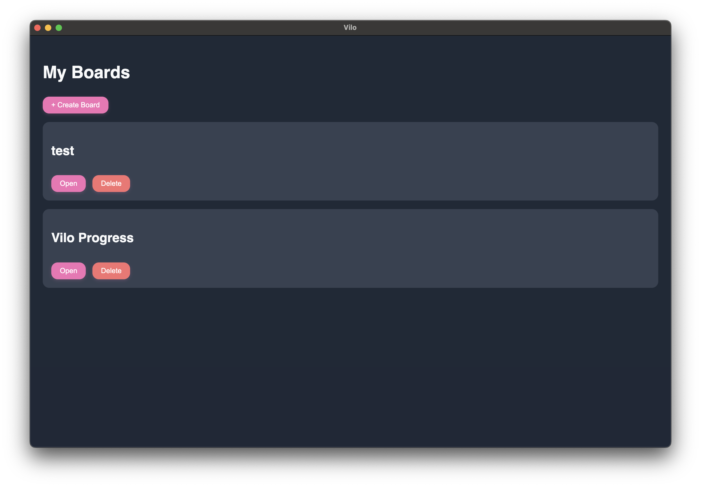
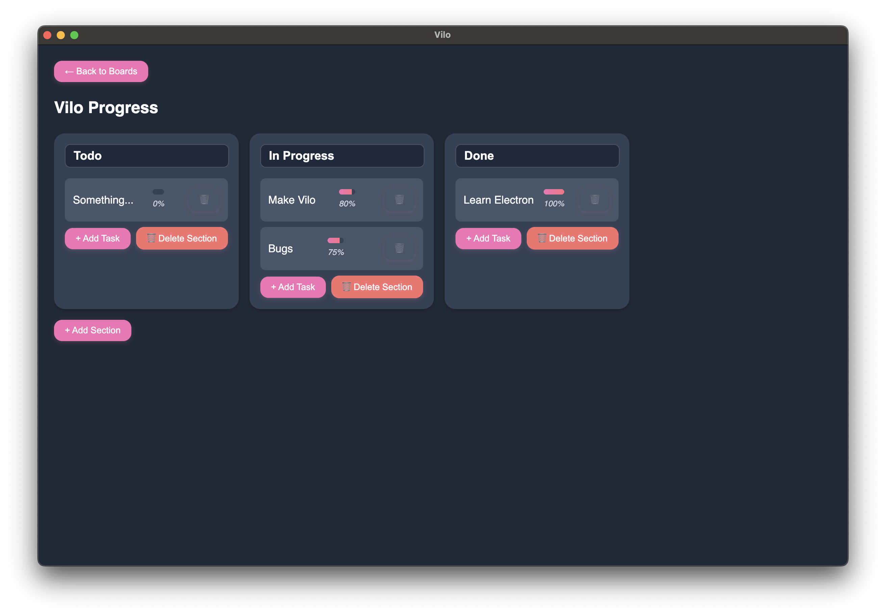
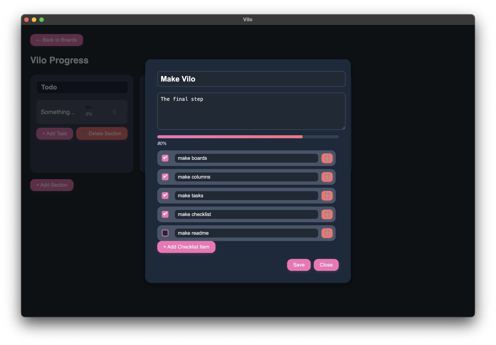

# 🌸 Vilo – A Cute & Simple Trello-style Task Manager

    

Vilo is a simple desktop app that I created just to learn Electron and definitely not because I was too lazy to sign back into to Trello... Anyways a simple place to keep track of your tasks and progress offline! 

Still more stuff todo like small bug fixes and visual improvements but I want to show it off a bit. I wonder what I should add next???

---

## ✨ Features

- 🧩 **Boards** – Create as many boards as you want to categorize your tasks.
- 📁 **Sections** – Inside each board, group your tasks with collapsible sections like "To Do", "In Progress", or "Done".
- ✅ **Tasks with Checklists** – Tasks can include detailed descriptions and interactive checklists with progress bars.
- 🖱️ **Drag & Drop** – Easily rearrange tasks and sections with smooth drag-and-drop functionality.
- 🎨 **UI** – Clean design with dark mode.
- 💾 **Auto-Save** – Your data is saved locally and automatically. No internet required.
- 🪟 **Overlay Task Viewer** – Click a task to open a pop-up with its full description and checklist.
- 📊 **Checklist Progress** – Visual progress bars track how far along you are in each task.

---

## 📸 Preview

### 🏠 Board Overview  

### 🗂️ Sections with Tasks  

### ✍️ Task Overlay with Checklist  

---